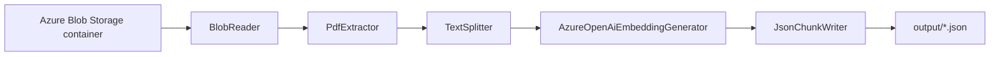

# DocumentIngestor

## Purpose

`DocumentIngestor` prepares source documents for downstream search and grounding workflows. It reads PDFs from Azure Blob Storage, extracts text, splits content into chunks, generates embeddings with Azure OpenAI, and writes chunk artifacts to local JSON files.

## Processing Pipeline

1. Read blobs from the configured Azure Storage container.
2. Download each PDF and extract text.
3. Split text into overlapping chunks.
4. Generate embeddings for each chunk using Azure OpenAI.
5. Write grouped chunk output to the `output/` folder.

## Architecture



## AI Components

- Embeddings are generated in `AzureOpenAiEmbeddingGenerator` using Azure OpenAI's embeddings client.
- Chunk vectors are stored in each `DocumentChunk` as `ContentVector`.

## Technologies

- .NET 10 / C#
- Azure Blob Storage SDK
- Azure OpenAI SDK
- PdfPig (`UglyToad.PdfPig`) for PDF parsing
- Microsoft.Extensions.Hosting and options/configuration patterns

## What I Implemented

- End-to-end orchestration in `IngestionPipeline`.
- PDF-to-text extraction service.
- Sentence-based chunking with configurable overlap (`Chunking.MaxTokens`, `Chunking.OverlapTokens`).
- Embedding generation and chunk mutation in-place.
- JSON artifact writer grouped by source file name.

## Configuration

Configuration is loaded from `appsettings.shared.json`, `appsettings.json`, and environment variables.

Required values:

- `Storage:AccountName`
- `Storage:ContainerName`
- `Storage__ApiKey` (environment variable)
- `AzureOpenAI:Endpoint`
- `AzureOpenAI:EmbeddingDeployment`
- `AzureOpenAI__ApiKey` (environment variable)
- `Chunking:MaxTokens`
- `Chunking:OverlapTokens`

## Running

From repository root:

```bash
dotnet run --project DocumentIngestor/DocumentIngestor.csproj
```

Output is written to `DocumentIngestor/output/`.

## Related Documentation

- [docs/learning-notes/Document-Ingestion.md](../docs/learning-notes/Document-Ingestion.md)
- [docs/learning-notes/AI200.md](../docs/learning-notes/AI200.md)
