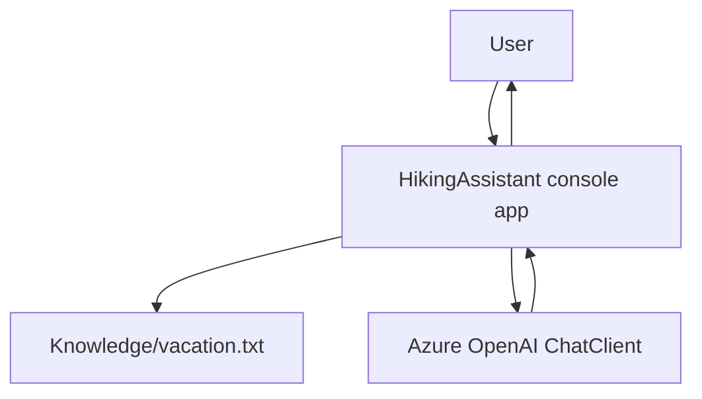

# HikingAssistant

## Purpose

`HikingAssistant` is the user-facing console application in this repository. It answers hiking-related questions with Azure OpenAI while grounding responses against a local knowledge document.

## How RAG Is Used

Current runtime flow:

1. User asks a question in the console.
2. The app builds a prompt that includes the full content of `Knowledge/vacation.txt`.
3. The prompt is sent to Azure OpenAI chat completion.
4. The assistant responds and conversation history is preserved in memory.

This is grounded generation, but not vector retrieval from Azure AI Search in the current implementation.

## Architecture



## Technologies

- .NET 10 / C#
- Azure OpenAI SDK (`Azure.AI.OpenAI`)
- Microsoft.Extensions.Hosting and logging
- DotNetEnv for local secret loading

## AI Components

- Chat completion via Azure OpenAI deployment (`AzureOpenAI:Deployment`).
- System prompt and generation parameters (`Temperature`, `MaxOutputTokens`) are configuration-driven.
- Grounding policy is enforced in prompt text ("Use ONLY the following document").

## What I Implemented

- Interactive CLI loop for Q&A.
- Azure OpenAI chat service abstraction (`IChatService` + `AzureOpenAIChatService`).
- Prompt-construction pattern for grounded responses.
- Conversation state management using message history.

## Configuration

Set these values in config and environment variables:

- `AzureOpenAI:Endpoint`
- `AzureOpenAI:Deployment`
- `AzureOpenAI:SystemPrompt`
- `AzureOpenAI:Temperature`
- `AzureOpenAI:MaxOutputTokens`
- `AzureOpenAI__ApiKey`

## Running

From repository root:

```bash
dotnet run --project HikingAssistant/HikingAssistant.csproj
```

Type questions at the prompt. Submit an empty line to exit.

## Related Documentation

- [readme.md](../readme.md)
- [docs/learning-notes/AI200.md](../docs/learning-notes/AI200.md)
