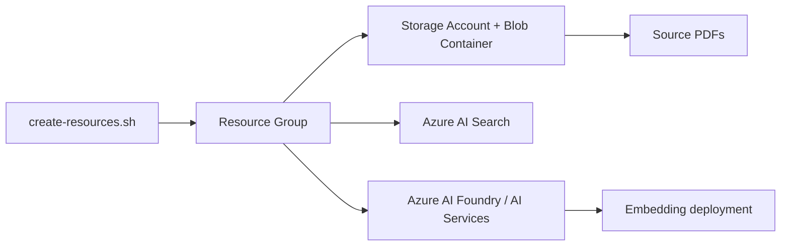

# Infrastructure

## Purpose

The `infra` folder contains shell scripts used to provision and tear down Azure resources required by this repository.

## What Is Provisioned

Based on `infra/scripts/create-resources.sh`, the script provisions:

- Azure Resource Group
- Azure Storage Account and Blob Container (source PDF storage)
- Azure AI Search service
- Azure AI Foundry/Azure AI Services account
- Embedding model deployment (`text-embedding-ada-002`)

It also uploads sample PDF files from `infra/raw/` to Blob Storage.

## Architecture



## How It Relates to the Applications

- `DocumentIngestor` reads PDFs from the provisioned Blob container and generates embeddings.
- `SearchBootstrapper` connects to the provisioned Azure AI Search service and creates the index.
- `HikingAssistant` uses Azure OpenAI configuration values hosted in the AI service account.

## Deployment

From the `infra/scripts/` directory:

```bash
bash create-resources.sh
```

To clean up:

```bash
bash delete-resources.sh
```

## Configuration and Security

- Set `AZURE_SUBSCRIPTION_ID` in your environment before running scripts.
- Use your own globally unique resource names.
- Do not commit API keys, subscription IDs, or local `.env` values.

## Related Documentation

- [../readme.md](../readme.md)
- [../docs/learning-notes/AI200.md](../docs/learning-notes/AI200.md)
- [../docs/learning-notes/Azure-AI-Search.md](../docs/learning-notes/Azure-AI-Search.md)
