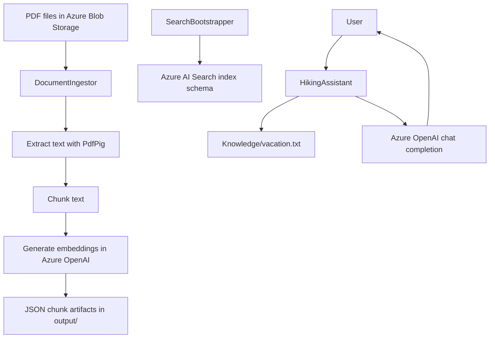

# AI200-Labs

AI200-Labs is a practical AI engineering project on Azure that demonstrates how to build the core pieces behind a knowledge-grounded assistant: search index provisioning, document ingestion and embedding generation, and a chat application that answers with grounded context.

## What I Built

I implemented a multi-project .NET solution with three executable components:

- Search schema provisioning for Azure AI Search.
- PDF ingestion from Azure Blob Storage with extraction, chunking, and embedding generation.
- A user-facing console assistant that uses Azure OpenAI with explicit grounding instructions.

Together, these components represent the production-facing building blocks of a Retrieval-Augmented Generation (RAG) system.

## What I Implemented

- Azure AI Search index bootstrap logic, including field schema generation and vector search profile setup.
- Document processing pipeline: blob enumeration, PDF text extraction, sentence-based chunking with overlap, and Azure OpenAI embedding generation.
- Structured chunk output as JSON artifacts for downstream indexing workflows.
- Console chat assistant with conversation state, system prompt control, and grounded prompting against project knowledge.
- Shared configuration model and environment-based secret loading across all apps.

## Architecture



## Projects

### DocumentIngestor

Processes PDF documents from Blob Storage into chunked, embedded JSON artifacts.

See [DocumentIngestor/readme.md](DocumentIngestor/readme.md).

### SearchBootstrapper

Creates and validates the Azure AI Search index structure used by document chunks.

See [SearchBootstrapper/readme.md](SearchBootstrapper/readme.md).

### HikingAssistant

Console-based assistant that uses Azure OpenAI and grounded prompts for hiking-related Q&A.

See [HikingAssistant/readme.md](HikingAssistant/readme.md).

### Infrastructure

Shell scripts for provisioning and deleting Azure resources used by this solution.

See [infra/readme.md](infra/readme.md).

## Technology Stack

- .NET 10 (C#)
- Azure OpenAI (`Azure.AI.OpenAI`)
- Azure AI Search (`Azure.Search.Documents`)
- Azure Blob Storage (`Azure.Storage.Blobs`)
- PdfPig for PDF text extraction
- DotNetEnv for local secret loading

## AI / RAG Flow

Implemented pipeline in this repository:

1. Document ingestion from Azure Blob Storage.
2. PDF text extraction.
3. Chunking with overlap.
4. Embedding generation with Azure OpenAI.
5. Search index provisioning for chunk documents.
6. Grounded LLM response generation in the assistant.

Current implementation note: the `HikingAssistant` app grounds responses from a local knowledge file and does not yet execute Azure AI Search retrieval queries at runtime.

## Running the Project

1. Copy `.env.example` to `.env` and set your own keys.
2. Build the solution:

```bash
dotnet restore
dotnet build AI200-Labs.slnx
```

3. Run components as needed:

```bash
dotnet run --project SearchBootstrapper/SearchBootstrapper.csproj
dotnet run --project DocumentIngestor/DocumentIngestor.csproj
dotnet run --project HikingAssistant/HikingAssistant.csproj
```

Project-level run details:

- [SearchBootstrapper/readme.md](SearchBootstrapper/readme.md)
- [DocumentIngestor/readme.md](DocumentIngestor/readme.md)
- [HikingAssistant/readme.md](HikingAssistant/readme.md)

## AI-200

This project was developed while preparing for Microsoft AI-200, but it is structured here as a practical implementation of Azure-based AI application patterns.

## Learning Notes

Original AI-200 learning and operational notes are preserved in:

- [docs/learning-notes/AI200.md](docs/learning-notes/AI200.md)
- [docs/learning-notes/Azure-AI-Search.md](docs/learning-notes/Azure-AI-Search.md)
- [docs/learning-notes/Document-Ingestion.md](docs/learning-notes/Document-Ingestion.md)

## Author

Repository owner: vigokkoe.